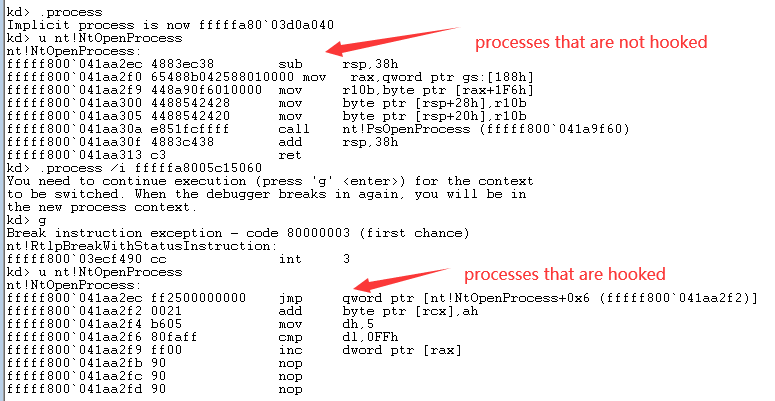
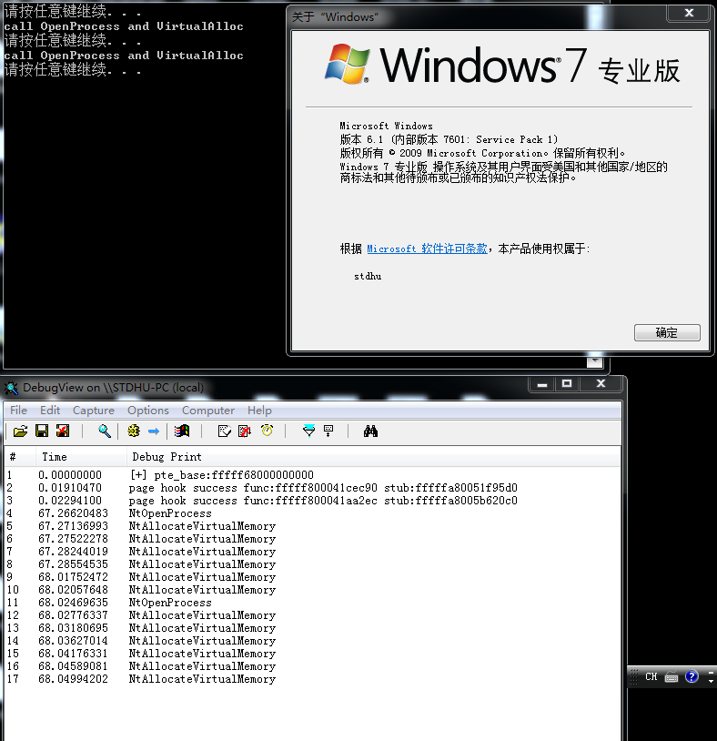
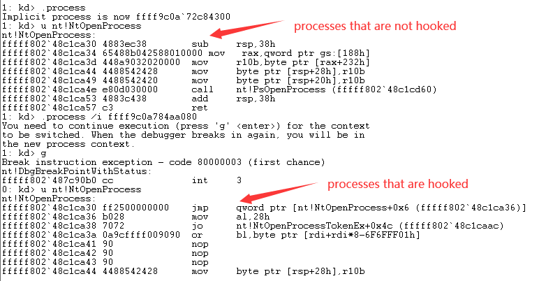
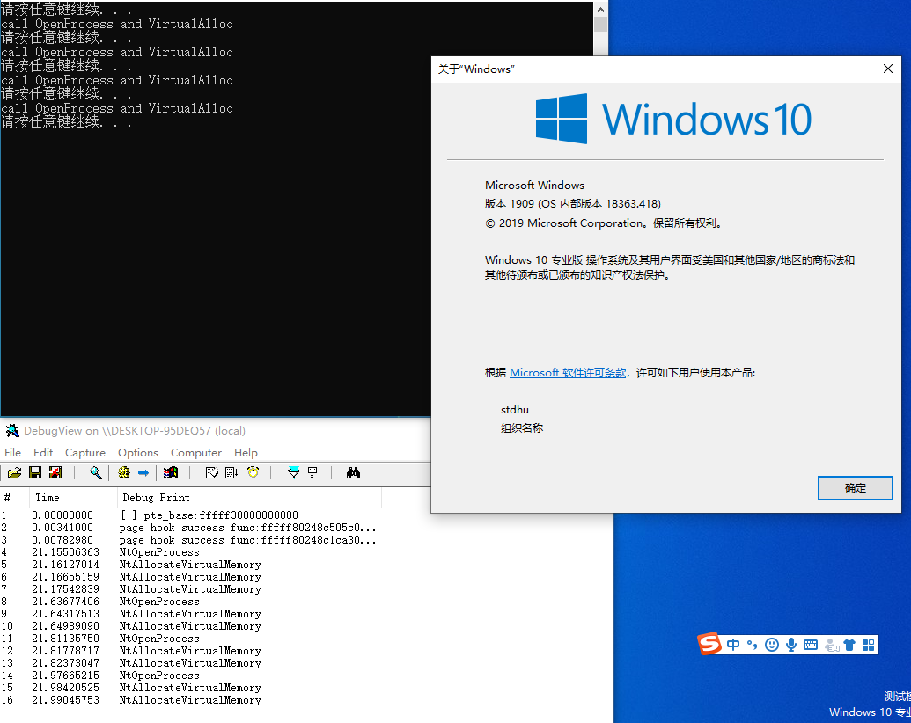

# windows kernel pagehook

## Introduction

Windows kernel pagehook is a driver that leverages the Windows kernel paging mechanism to hook process page table entries

## Description

Under the Windows kernel, the kernel address is shared, but since the cr3 of each process is different.

The purpose of pagehook can be achieved by replacing the cr3 under a process and the page table entry in it.

So that only the hooked process will go through the hooking process, and other processes will keep the original process unchanged.

The process to which PatchGuard generally belongs belongs to the system process, but since we are replacing the page table entries of other processes, we cannot scan it and achieve the purpose of hiding.

## Limits

Currently only supports windows 64 bit system.

1. Windows 7 x64 sp1 (test passed)
2. Windows 10 x64  1909 18363.418 (test passed)

## Feature

1. Supports hooking multiple kernel functions in the same process
2. Support for hooking multiple processes at the same time

## Build

Visual Studio 2017 

WDK version 10.0.17763.0

Open windows-kernel-pagehook.sln with Visual Studio

Build project as x64/Release or x64/Debug.(No x86 support for now)

## Snapshots

### windows 7 x64 sp1

### windows 10 x64 1909

